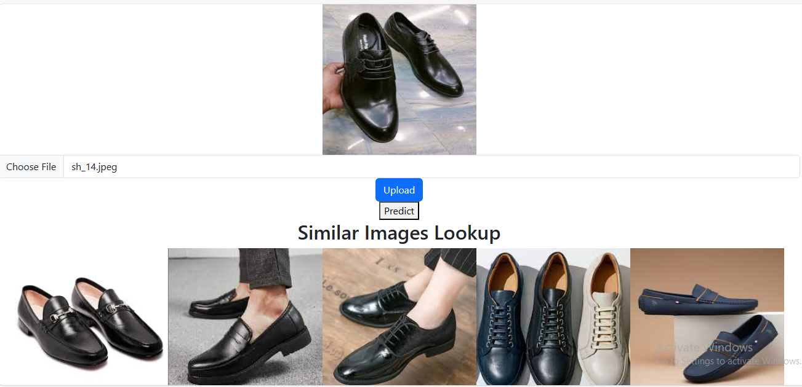
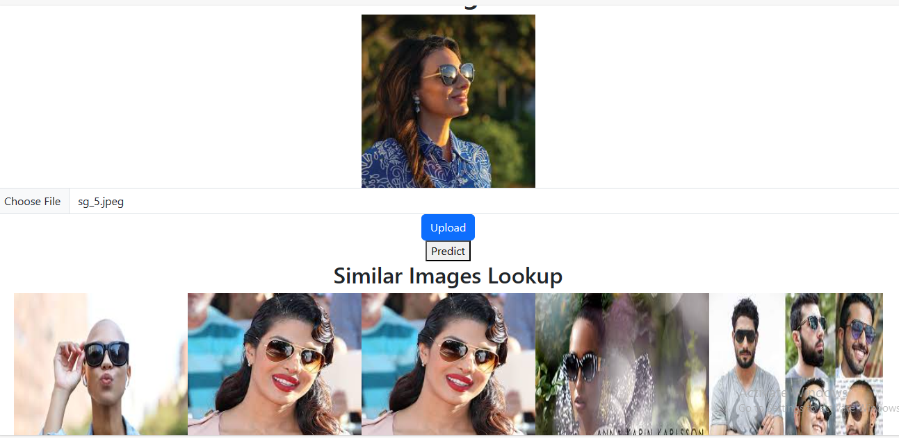

## reverse_image_search
Reverse image search is a technology that allows you to find similar images or identical images to a given queried image by using image processing and search algorithms. Instead of using text or keywords to search for images you provide an image as an input  to the system and the system finds images that visually match or are related to the input image.
Used weaviate dense vector database for storing and retrieving closest dense vector using cosine similarity.

Dependencies used : 
    * Python 
    * Django 
    * Tensorflow 
    * CNN 
    * Weaviate 
    * Javascript 
    * React.js 
    * Docker 

Metrics used is top k precision given k parameter
Top_k_precision: 350 and test_data: 457, score:94%, Xtrain:4106

pip install -r requirements.txt

1. Clone Weaviate
    1. git clone https://github.com/weaviate/weaviate.git
    2. Replace the docker-compose.file in weaviate with parent directory docker-compose file
    rm -rf weaviate\docker-compose.yml && mv docker-compose.yml weaviate/
    3. cd weaviate && docker build --target weaviate -t weav_image .
    4. docker-compose  up
    `This will run the weaviate server.`

2. Ingest vectors to weaviatedb
    1. Run the python get_similar_apparel.py 1 (for ingestion) likewise 0 for just prediction

3. Start the react frontend interface.
    1. cd frontend && npm start (also download the dependices)

